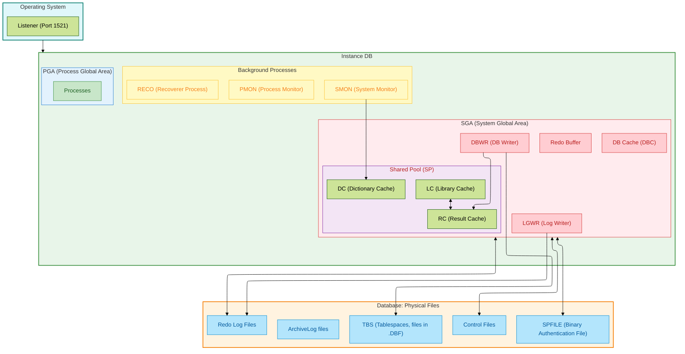

## Oracle DB Diagram

## Explanation 

An **Oracle server** includes an **Oracle Instance** and an **Oracle Database**.

### Oracle Instance

**PGA (Process Global Area)**: Handles calculations.

**SGA (System Global Area)** contains:
  - **DBC (DB Cache)**: When modification queries are made, it keeps the original row in a temporary undo file.
    - If another user requests the same information, the DB Cache will provide the result from the undo tablespace (i.e., before the modification). The modification must be "committed" for other users to see the latest update.
    - Two users cannot modify the same row simultaneously (thanks to the DB Cache).
  - **DBWR (DB Writer)**: Writes to the appropriate tablespace and updates the cache.
  - **LGWR (Log Writer)**: Writes to the REDO log.
  - **SP (Shared Pool)** contains three components:
    - **DC (Dictionary Cache)**: Stores metadata about the database.
    - **LC (Library Cache)**: If someone has already requested something and requests it again, the library cache indicates where the information is located.
    - **RC (Result Cache)**: Stores query results for reuse.

The **SGA** interacts with:
  - **SPFILE**: A binary file containing authentication information. (Alternatively, there is `init.ora`, which is a text file.)
  - **CTRL_File (Control File)**: The most important file, containing version information, the location of backups on disks, and the locations of database files.
  - **REDO**: (50 MB) A log of the most recent operations performed on the database.

- **Background Processes** :
  - **PMON (Process Monitor)**: Monitors processes.
  - **SMON (System Monitor)**: Updates the dictionary cache (DC) and tablespace information.
  - **RECO**