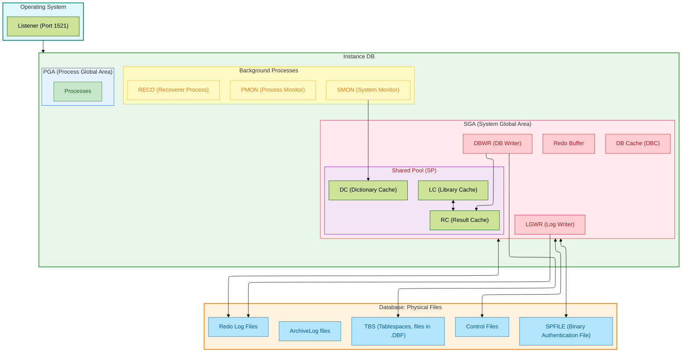

## Oracle DB Diagram


```mermaid
---
config:
  theme: forest
  layout: elk
---
flowchart TD
  subgraph s1["Instance DB"]
    style s1 fill:#E8F5E9,stroke:#388E3C,stroke-width:2px

    subgraph s1a["Background Processes"]
      style s1a fill:#FFF9C4,stroke:#FBC02D,stroke-width:1px
      n5["PMON (Process Monitor)"]
      n6["SMON (System Monitor)"]
      n10["RECO (Recoverer Process)"]
    end

    subgraph s1b["PGA (Process Global Area)"]
      style s1b fill:#E3F2FD,stroke:#1976D2,stroke-width:1px
      n1["Processes"]
    end

    subgraph s1c["SGA (System Global Area)"]
      style s1c fill:#FFEBEE,stroke:#D32F2F,stroke-width:1px
      subgraph n7["Shared Pool (SP)"]
        style n7 fill:#F3E5F5,stroke:#7B1FA2,stroke-width:1px
        n7a["DC (Dictionary Cache)"]
        n7b["LC (Library Cache)"]
        n7c["RC (Result Cache)"]
      end
      n8["DB Cache (DBC)"]
      n9["Redo Buffer"]
      n3["DBWR (DB Writer)"]
      n4["LGWR (Log Writer)"]
      n5["PMON (Process Monitor)"]
      n6["SMON (System Monitor)"]
      n10["RECO (Recoverer Process)"]
    end
  end

  subgraph s2["Database: Physical Files"]
    style s2 fill:#FFF3E0,stroke:#F57C00,stroke-width:2px
    n11["TBS (Tablespaces, files in .DBF)"]
    n12["Redo Log Files"]
    n13["Control Files"]
    n14["SPFILE (Binary Authentication File)"]
    n15["ArchiveLog files"]
  end

  subgraph s3["Operating System"]
    style s3 fill:#E0F7FA,stroke:#00796B,stroke-width:2px
    n16["Listener (Port 1521)"]
  end

  n3 --> n11
  n3 --> n7c
  n4 --> n12
  n6 --> n7a
  s3 --> s1
  s1c <--> n12
  s1c <--> n13
  s1c <--> n14
  n7b <--> n7c

  classDef Aqua stroke-width:1px, stroke-dasharray:none, stroke:#0288D1, fill:#B3E5FC, color:#01579B
  classDef Yellow stroke-width:1px, stroke-dasharray:none, stroke:#FBC02D, fill:#FFF9C4, color:#F57F17
  classDef Green stroke-width:1px, stroke-dasharray:none, stroke:#388E3C, fill:#C8E6C9, color:#1B5E20
  classDef Red stroke-width:1px, stroke-dasharray:none, stroke:#D32F2F, fill:#FFCDD2, color:#B71C1C

  class n11,n12,n13,n14,n15 Aqua
  class n5,n6,n10 Yellow
  class n1 Green
  class n7,n8,n9,n3,n4 Red
```

## Explanation 

An **Oracle server** includes an **Oracle Instance** and an **Oracle Database**.

### Oracle Instance

**PGA (Process Global Area)**: Handles calculations.

**SGA (System Global Area)** contains:
  - **DBC (DB Cache)**: When modification queries are made, it keeps the original row in a temporary undo file.
    - If another user requests the same information, the DB Cache will provide the result from the undo tablespace (i.e., before the modification). The modification must be "committed" for other users to see the latest update.
    - Two users cannot modify the same row simultaneously (thanks to the DB Cache).
  - **DBWR (DB Writer)**: Writes to the appropriate tablespace and updates the cache.
  - **LGWR (Log Writer)**: Writes to the REDO log.
  - **SP (Shared Pool)** contains three components:
    - **DC (Dictionary Cache)**: Stores metadata about the database.
    - **LC (Library Cache)**: If someone has already requested something and requests it again, the library cache indicates where the information is located.
    - **RC (Result Cache)**: Stores query results for reuse.

The **SGA** interacts with:
  - **SPFILE**: A binary server parameter file (the text equivalent is `init.ora`).
  - **CTRL_File (Control File)**: The most important file, containing version information, the location of backups on disks, and the locations of database files.
  - **REDO**: (50 MB) A log of the most recent operations performed on the database.

- **Background Processes** :
  - **PMON (Process Monitor)**: Monitors processes.
  - **SMON (System Monitor)**: Updates the dictionary cache (DC) and tablespace information.
  - **RECO (Recoverer Process)**: Recovers distributed transactions.

## Which database am I on?

```sql
SELECT * FROM global_name;
SHOW PARAMETER name;
```

## Oracle default locations

Oracle creates files in these places:

* `/var/tmp/.oracle/`
* `/etc/oracle/` — `oraInst.loc`, `oratab`
* `/u01`

## Explore the tables & schemas

```sql
DESCRIBE ALL_TABLES;                               -- info about the tables.
SELECT table_name FROM all_tables;                 -- all tables on the instance.

SELECT object_name, object_type FROM user_objects ORDER BY object_type, object_name;
-- USER_OBJECTS is the data dictionary of the schema you are connected as.

SELECT table_name FROM all_tables WHERE owner = 'YOUR_SCHEMA';  -- tables of one schema.
```

```sql
SELECT * FROM employees;   -- see a table.
DESCRIBE employees;        -- see the columns of the "employees" table.
```

## Dynamic views (v$…)

`v$fixed_table` lists every available dynamic view. The main ones:

* `v$parameter` — initialization parameters. (`SHOW PARAMETER control` = `SELECT … FROM v$parameter WHERE name LIKE '%control%'`.)
* `v$system_parameter` — parameters and their pending modifications.
* `v$sga` — SGA info.
* `v$option` — the options installed on the server.
* `v$process` — the current active processes.
* `v$session` — the current session info.
* `v$version` — the version number and components.
* `v$instance` — the current instance state.
* `v$thread` — threads / redo log groups.
* `v$controlfile` — the control file names (empty at NOMOUNT).
* `v$database` — database info.
* `v$datafile` — data & control file info.
* `v$datafile_header` — datafile headers from the control file.
* `v$logfile` — redo log files.

Some parameters are changeable with `ALTER SESSION` or `ALTER SYSTEM`:

```sql
ALTER SESSION SET sql_trace = TRUE;                 -- current session only.
ALTER SYSTEM SET timed_statistics = TRUE;           -- until shutdown.
ALTER SYSTEM SET sort_area_size = 131072 DEFERRED;  -- applies to new connections.
```

Find the modified parameters:

```sql
SELECT name, isses_modifiable, issys_modifiable, ismodified
FROM v$system_parameter WHERE ismodified != 'false';
```

`v$system_parameter` columns: `NAME`, `TYPE` (1 boolean · 2 string · 3 integer · 4 file · 5 reserved · 6 long integer), `VALUE`, `ISDEFAULT`, `ISSES_MODIFIABLE`, `ISSYS_MODIFIABLE`, `DEFERRED`, `ISMODIFIED`, `ISADJUSTED`, `UPDATE_COMMENT`.

`DESCRIBE` shows the columns of a view:

```sql
DESCRIBE v$instance;
```

`SELECT * FROM v$instance;` returns every column of that view.
