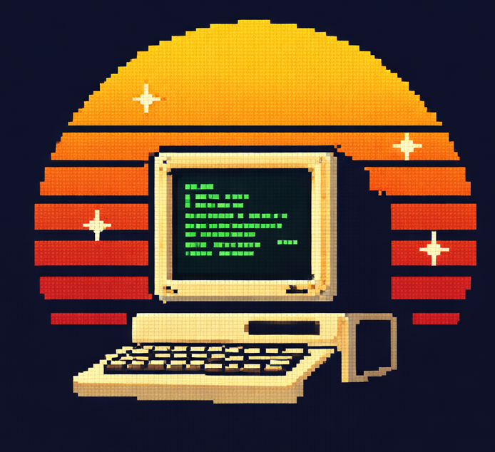



Those projects are just *pet-projects* made on my free-time, and give me the opportunity to play arround with techs. No big ambitions here but always open to contributions.



| Logo | Title | Description | References |
| :- | :-: | :- | :- |
|  | WST | A menu to deploy my workstation on WSL | <a target="_blank" href="https://github.com/MozeBaltyk/wst">github link</a>  |
|  | Rkub | Ansible Collection to deploy a RKE2 cluster with Rancher, Longhorn and Neuvector in Airgap mode. | <a target="_blank" href="https://github.com/MozeBaltyk/Rkub">github link</a>  |
|  | Okub | Collection to deploy OKD on diverse providers | <a target="_blank" href="https://github.com/MozeBaltyk/Okub">github link</a>  |
|  | UpOnLAN | A Wake-on-lan, Pxeboot server and a webapp in container. | <a target="_blank" href="https://github.com/MozeBaltyk/UpOnLAN">github link</a>  |
{_borderless=true}
